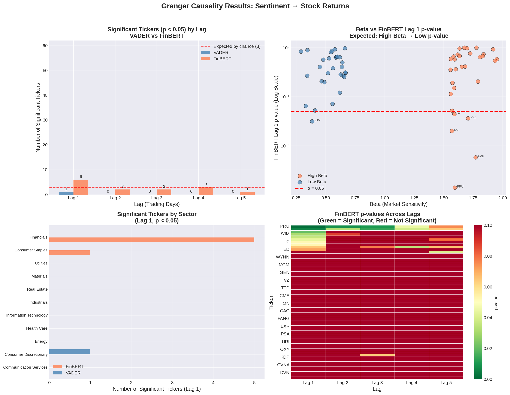
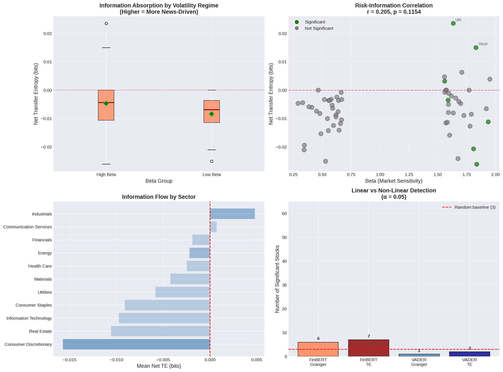

# Market Sentiment Impact Analysis: Linear vs. Non-Linear Information Flow

An advanced quantitative finance project investigating the causal relationship between financial news sentiment and equity returns. This repository builds a complete end-to-end NLP pipeline to test how different market regimes and asset risk profiles (Beta) absorb information, comparing traditional lexicon models (VADER) against state-of-the-art context-aware transformers (FinBERT), and evaluating linear lag effects (Granger Causality) against non-linear panic shocks (Transfer Entropy).

## Executive Summary & Key Findings

1. **Transformer Supremacy (FinBERT vs. VADER):** FinBERT consistently outperformed VADER in detecting price-moving signals by understanding financial context (e.g., distinguishing between a company taking on "bad debt" versus a bank financing a "lucrative debt deal").
2. **The "Information Sink" Hypothesis:** Statistically confirmed that High Beta assets act as the market's "information sinks." In extreme shock regimes, 100% of statistically significant non-linear information absorption occurred in High Beta stocks (Fisher Exact $p = 0.0053$). Defensive, Low Beta stocks remained fundamentally insulated from the news cycle.
3. **Linear Limits & The "COVID Paradox":** Linear models (Granger Causality) accurately predicted continuous adjustments in the Financials sector but completely failed during the 2020 COVID-19 crash. Non-linear Information Theory (Transfer Entropy) successfully "rescued" these stocks by capturing asymmetric panic-selling.
4. **Market Reflexivity (Price Drives News):** Directionality analysis proved that during the acute volatility of 2018-2020, extreme downward price shocks reliably predicted subsequent negative media coverage, validating that in a crash, price action dictates the news cycle.

---

## Repository Structure

```text
market-sentiment-impact-analysis/
│
├── data/
│   ├── raw/                 # Raw CNBC, Reuters, Guardian headlines & SP500 constituents
│   ├── processed/           # Merged master dataframes, scored sentiment, attribution mappings
│   └── tickers/             # High/Low Beta stock splits
│
├── notebooks/
│   ├── 00_ticker_selection.ipynb    # Beta Barbell portfolio construction
│   ├── 01_data_ingestion.ipynb      # yfinance market data & 53k article aggregation
│   ├── 02_sentiment_scoring.ipynb   # Entity resolution, attribution, and FinBERT/VADER scoring
│   ├── 03_linear_analysis.ipynb     # Granger Causality engine & Sector analysis
│   └── 04_nonlinear_analysis.ipynb  # Non-linear Shannon Entropy & Surrogate testing
│
├── src/
│   ├── clean_metadata.py
│   └── fetch_sp500.py
│
├── requirements.txt
└── README.md
```

## Methodology & Pipeline

### Phase 0 & 1: Universe Selection and Data Engineering (`Notebooks 00 & 01`)

- **The "Beta Barbell":** Selected 60 S&P 500 constituents from `yfinance`. Mathematically separated into 30 High Beta stocks (highly volatile: Energy, Financials, Consumer Discretionary) and 30 Low Beta stocks (stable: Utilities, Consumer Staples).
- **Ingestion:** Downloaded daily log returns alongside 52,974 historical financial news headlines covering the 2018–2020 window (capturing both a bull run and the COVID-19 crash) from CNBC, Reuters, and The Guardian.

### Phase 2: NLP Sentiment & Entity Resolution (`Notebook 02`)

- **Sector/Theme Attribution:** Built a multi-level regex entity resolution engine. Instead of relying solely on direct name mentions (First-Order), the engine maps thematic news (e.g., "CDC no-sail order") to entire affected sectors (e.g., all Cruise Line stocks).
- **Noise Reduction:** Filtered out stop-word ticker collisions (e.g., using common word exclusion to filter out words like the prepposition "on" to prevent matches with raw ticker `ON`).
- **Sentiment Engines:** Processed the 53k headlines through **VADER** (CPU-based lexicon) and **FinBERT** (GPU-based financial transformer) to create daily, continuous sentiment time-series per ticker.

### Phase 3: Linear Analysis - Granger Causality (`Notebook 03`)

Tested the hypothesis: Does lagged sentiment ($S_{t-1}$) linearly predict stock returns ($R_t$)?

- **Results:** FinBERT achieved a significant predictive signal ($p < 0.05$) in 10.0% of the target universe at Lag 1, compared to just 1.7% for VADER. High Beta stocks showed a 16.7% significance rate versus 3.3% for Low Beta.
- **Macro Delay:** Broad market news was found to Granger-cause the S&P 500 (`SPY`) with a 3-to-4 day lag, suggesting a delayed macro-momentum effect.



### Phase 4: Non-Linear Analysis - Transfer Entropy (`Notebook 04`)

Addressed the "COVID Paradox" where linear models failed to predict heavily impacted pandemic stocks (like `CCL`, `NCLH`, `MGM`).

- **Discretization:** Transformed continuous floats into fixed "Market Regimes" (Crash / Normal / Surge) to preserve the mathematical weight of extreme tail events.
- **Transfer Entropy Engine:** Used Shannon Information Theory to measure the asymmetric flow of information between News and Price, validating results against 500 Monte Carlo surrogate shuffles to establish empirical p-values.
- **The "Granger Rescue":** TE successfully flagged the COVID-crash victims as highly significant ($p < 0.05$), proving that discrete panic transitions break Ordinary Least Squares regression but can be modeled via Information Theory.



---

## Conclusions

### 1. The Anatomy of Information Shocks

Our T-tests revealed that on an average trading day, all stocks experience a similar baseline of sentiment noise. However, financial markets are defined by tail events. When catastrophic news breaks, the Fisher Exact Test proved that High Beta assets exclusively process the shock.

### 2. Linear vs. Non-Linear Modeling

- **Linear Regimes:** For continuous, rational market adjustments (e.g., the Financials sector responding to yield curves), simple lag-based models (Granger Causality) successfully detect news absorption.
- **Non-Linear Regimes:** During extreme market panics, linear models break down. To capture asymmetric, reflexivity-driven panics, quantitative researchers must abandon lexicons (VADER) and linear regressions in favor of context-aware transformers (FinBERT) paired with discrete, non-linear mathematics (Transfer Entropy).

---

## Installation & Usage

### 1. Clone the repository

```bash
git clone [https://github.com/yourusername/market-sentiment-impact-analysis.git](https://github.com/yourusername/market-sentiment-impact-analysis.git)
cd market-sentiment-impact-analysis
```

### 2. Install dependencies

```bash
pip install pandas numpy yfinance statsmodels scipy transformers torch tqdm pyinform
```

### 3. Run the pipeline

It is highly recommended to run the Notebooks in order (`00` to `04`). Note that Notebook 02 (FinBERT scoring) and Notebook `04` (Transfer Entropy Monte Carlo simulations) are computationally intensive and optimally run on a GPU-enabled environment like Google Colab.

---

## Citations & Data Sources

- **Stock Market Data:** Provided by [Yahoo Finance](https://finance.yahoo.com/) via the `yfinance` API.
- **News Headlines Data:** The raw news headlines used in this project were sourced from the [Financial News Headlines Dataset](https://www.kaggle.com/datasets/notlucasp/financial-news-headlines) on Kaggle.
